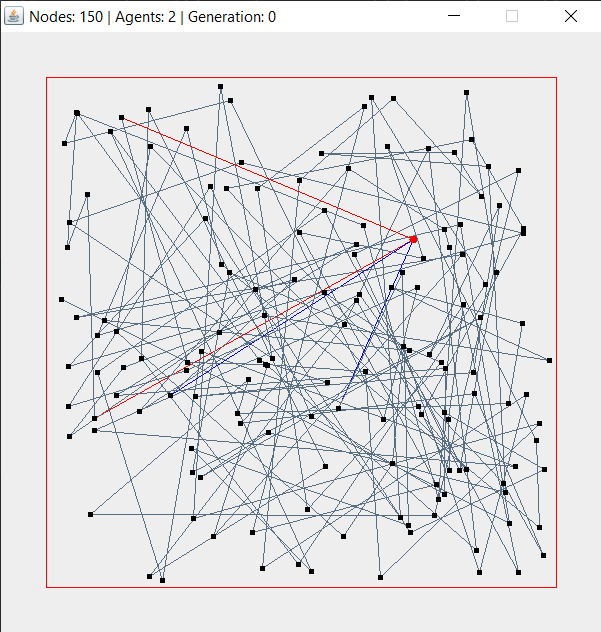
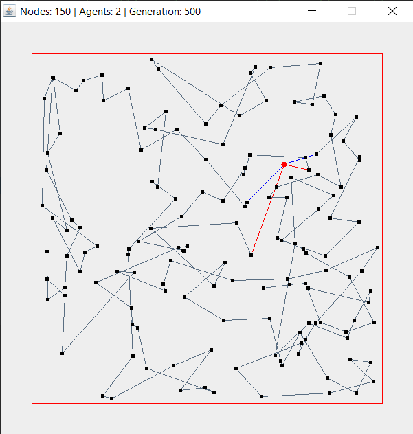
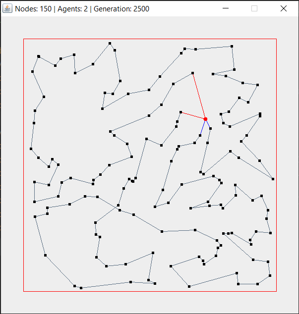
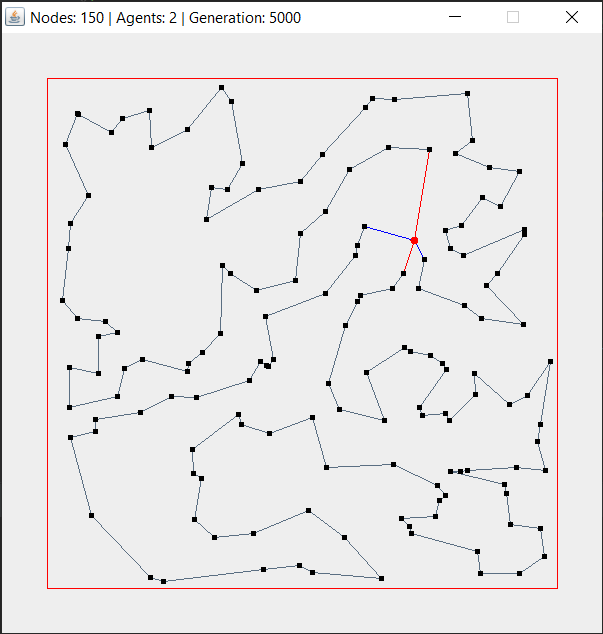
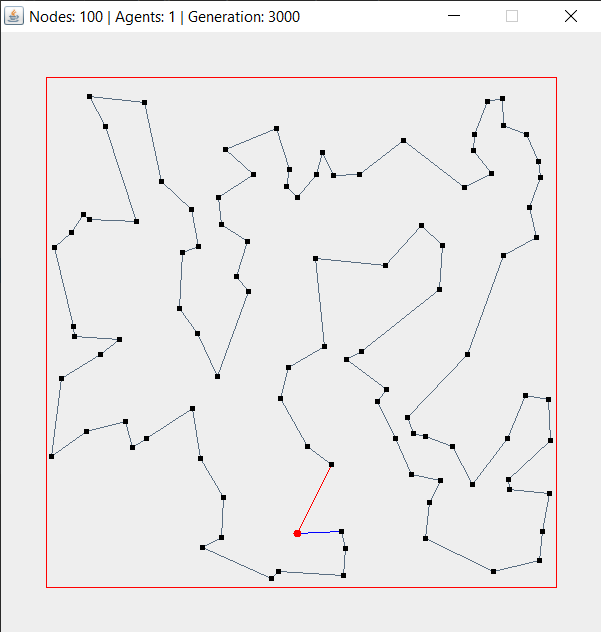
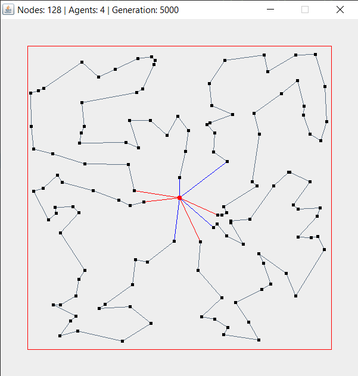
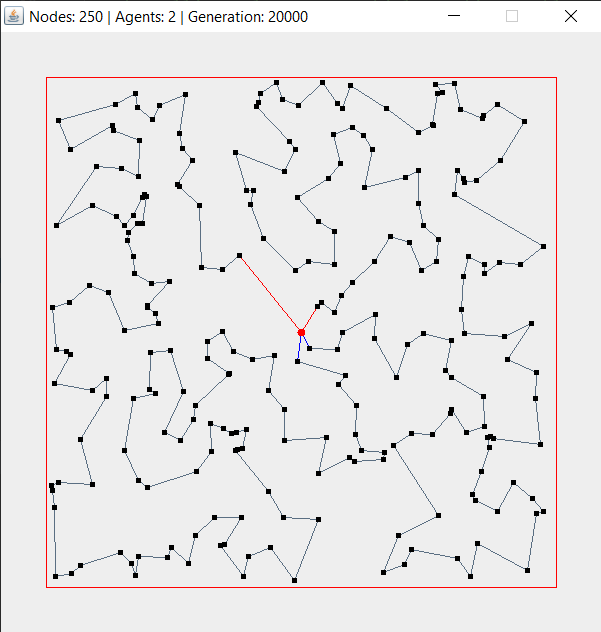
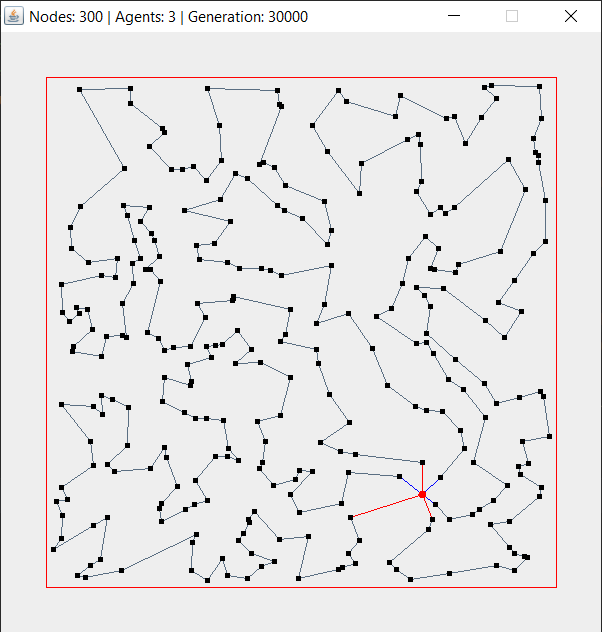
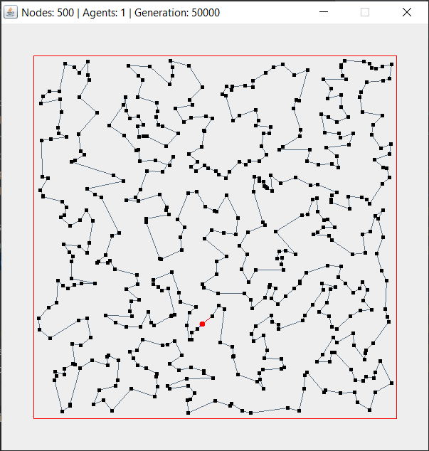
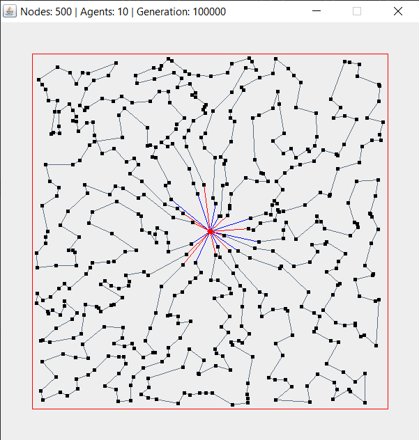

# Surveyor GA
Java implementation of a genetic algorithm that finds optimal paths for the vehicle
routing and travelling salesman problems.

## Usage

**Requirements**: Java 1.8+ locally installed.

1. Clone or download the repository.
2. Modify parameters in [Main.java](src/io/thebitspud/vrp/ui/Main.java) as desired.
3. Run [Main.java](src/io/thebitspud/vrp/ui/Main.java) using an IDE or CLI.

I will most likely add an executable applet at some point, but for now the program
must be run via command line.

## Example Progression

This is an example of what the best route will look like as the genetic algorithm
iteratively optimizes its solutions.

|  |  |
|------------------------------------|------------------------------------|
|  |  |

## More Examples

Here are some additional examples of vehicle routing problems solved by the algorithm
(along with the approximate number of generations it took to settle on an optimal solution).

|   |    |
|------------------------------------------|--------------------------------------------|
|  |    |
|   |  |
